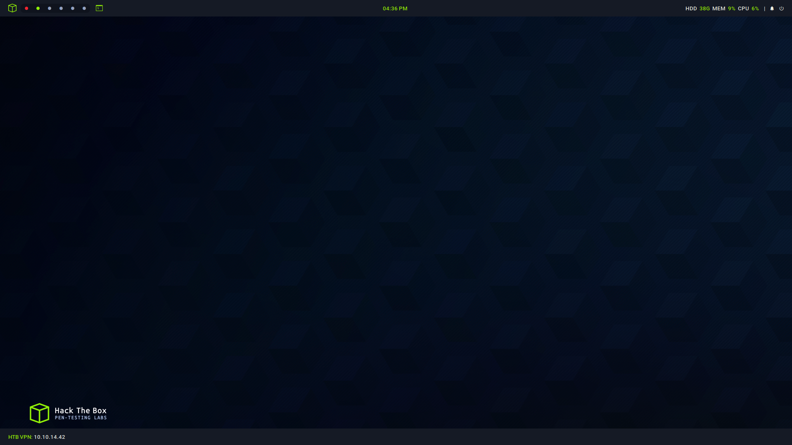
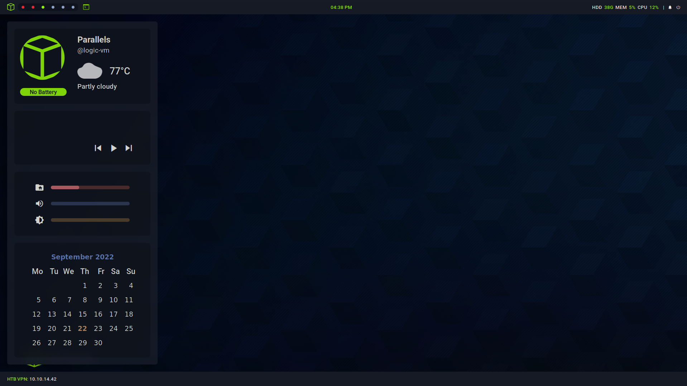
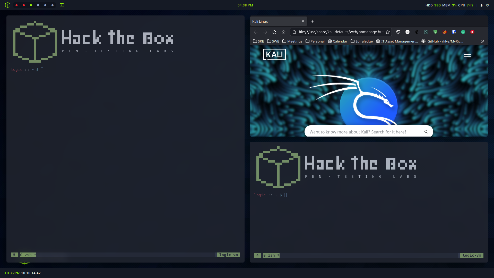
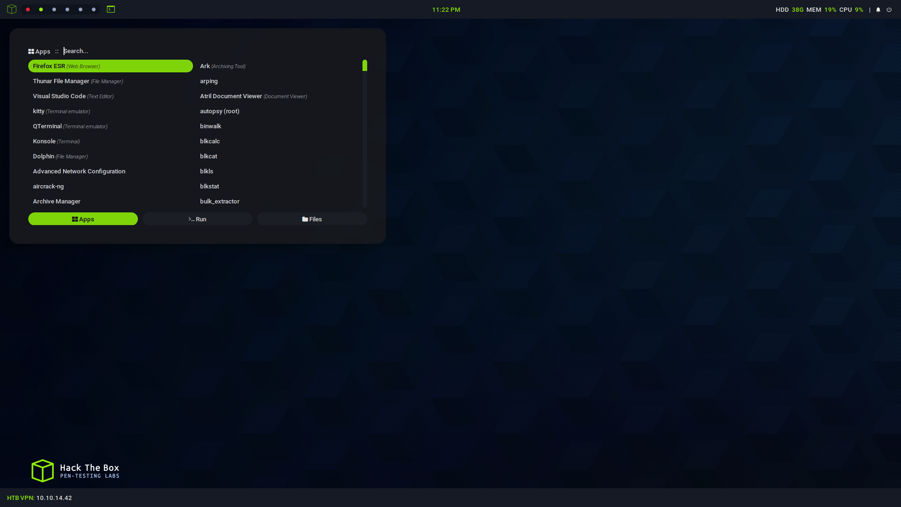

```bash
  █  █         ▐▌     ▄█▄ █          ▄▄▄▄
  █▄▄█ ▀▀█ █▀▀ ▐▌▄▀    █  █▀█ █▀█    █▌▄█ ▄▀▀▄ ▀▄▀
  █  █ █▄█ █▄▄ ▐█▀▄    █  █ █ █▄▄    █▌▄█ ▀▄▄▀ █▀█
  P  E  N   -   T  E  S  T  I  N  G     L  A  B  S
```


### How do I get this

### 1. Install the Dependencies
  
  - [awesome-git](https://aur.archlinux.org/packages/awesome-git)
  - [picom (ibhagwan fork)](https://github.com/ibhagwan/picom)
  - jq
  - inotify-tools
  - playerctl
  - brightnessctl
  - pulseaudio / pipewire-pulse
  - network-manager
  - mpd
  - mpDris2
  - ncmpcpp
  - xclip
  - maim
  - pamixer
  - rofi
  - wezterm
  - neovim
  - feh

<br>

**Required Fonts**

- [Material Design Icons](https://materialdesignicons.com/)
- Roboto

```sh
# Arch Linux
yay -S awesome-git mpd ncmpcpp jq inotify-tools playerctl brightnessctl \
pulseaudio networkmanager mpdris2 xclip maim pamixer rofi wezterm \
thunar neovim feh
```

```sh
# Debian Linux
sudo apt install mpd ncmpcpp jq inotify-tools playerctl brightnessctl \
pulseaudio network-manager mpdris2 xclip maim pamixer rofi \
thunar neovim feh

# Install wezterm
curl -LO https://github.com/wez/wezterm/releases/download/20220905-102802-7d4b8249/wezterm-20220905-102802-7d4b8249.Ubuntu20.04.deb
sudo apt install -y ./wezterm-20220905-102802-7d4b8249.Ubuntu20.04.deb
```

Start the MPD Service

```sh
systemctl enable --user mpd.service; systemctl start mpd.service
systemctl enable --user mpDris2.service; systemctl start mpd.service
```

<br>

### 2. Clone the repo

```sh
git clone https://github.com/lexlogic/htb
cd htb
git submodule init
git submodule update
```

Choose your /home disk in awesome.signals.disk. ex. /dev/sda2

Put your city name inside awesome.signals.weather


<br>

### 3. Move the config to .config directory

```sh
cd ..
cp -rf htb $HOME/.config/awesome
```transparency:                "real";
    location:                    center;
    anchor:                      center;
    fullscreen:                  false;
    width:                       800px;
    x-offset:                    0px;
    y-offset:                    0px;


<br>

Sidebar

<br>

Tiling

<br>

Launcher

<br>